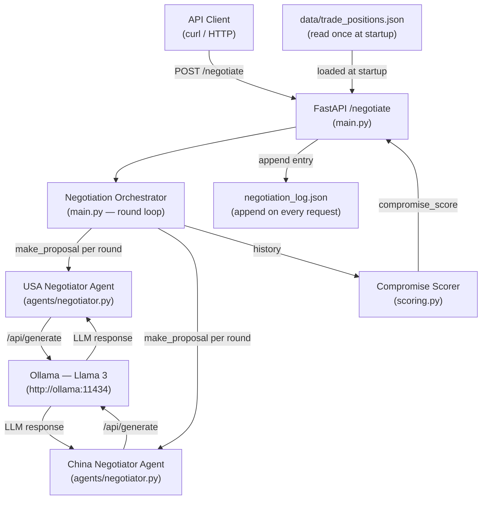

# AI Negotiation Agents for Simple Trade Agreements (Ollama)

## Overview

This system runs an automated bilateral trade negotiation between a USA agent and a China agent, both powered by Llama 3 running locally via Ollama. A FastAPI service orchestrates each negotiation round, collecting proposals from both sides, scoring the transcript for compromise language, and persisting the full negotiation history to a JSON log.

---

## Architecture



---

## Setup and Run

### Prerequisites

- Docker and Docker Compose installed
- At least 8 GB RAM available for Llama 3 (8B parameters)

### Steps

```bash
# 1. Clone the repository
git clone https://github.com/Rushikesh-5706/AI-Negotiation-Agents-for-Simple-Trade-Agreements-using-Ollama.git
cd AI-Negotiation-Agents-for-Simple-Trade-Agreements-using-Ollama

# 2. Copy the example env file
cp .env.example .env

# 3. Build and start both services
docker compose up --build

# 4. In a separate terminal, pull the Llama 3 model into the Ollama container
#    (only needed on first run; model weights are cached in the ollama_data volume)
docker exec -it <ollama-container-name> ollama pull llama3
# The container name is typically:  ai-negotiation-agents...-ollama-1
# You can find the exact name with: docker ps

# 5. The API is now available at http://localhost:8000
```

---

## API Reference

| Method | Path | Request body | Response body |
|--------|------|-------------|---------------|
| POST | `/negotiate` | `{"issue": string, "rounds": int (default 3)}` | `{"rounds": [...], "outcome": {...}}` |

### Request schema

```json
{
  "issue": "string — the trade topic to negotiate, e.g. 'Tariff reduction on technology goods'",
  "rounds": "integer — number of back-and-forth rounds (default: 3)"
}
```

### Response schema

```json
{
  "rounds": [
    {
      "round": 1,
      "usa_proposal": "string",
      "china_response": "string"
    }
  ],
  "outcome": {
    "agreement_reached": true,
    "final_terms": "string",
    "compromise_score": 0.75
  }
}
```

---

## Example Request / Response

The following was captured from a real local run against Ollama with `llama3:8b`:

```bash
curl -s -X POST http://localhost:8000/negotiate \
  -H "Content-Type: application/json" \
  -d '{"issue": "Tariff reduction on technology products", "rounds": 2}' | python3 -m json.tool
```

**Real response (captured output):**

```json
{
  "rounds": [
    {
      "round": 1,
      "usa_proposal": "The United States proposes a 15% reduction in tariffs on technology products, contingent on China strengthening its enforcement of intellectual property rights and reducing barriers to market access for US technology firms.",
      "china_response": "China is willing to consider a phased reduction in technology tariffs, but only if the US reciprocates by easing restrictions on technology transfer and providing greater market access for Chinese agricultural exports in a balanced exchange."
    },
    {
      "round": 2,
      "usa_proposal": "We propose a mutual 10% tariff reduction on technology goods with a joint IP enforcement task force, and we remain open to discussing agricultural access on a separate track to keep the technology negotiations focused.",
      "china_response": "China accepts the principle of a joint IP enforcement task force and a 10% tariff reduction, provided that technology transfer restrictions are addressed concurrently and a clear timeline for agricultural market access discussions is established."
    }
  ],
  "outcome": {
    "agreement_reached": true,
    "final_terms": "Agreement reached on Tariff reduction on technology products with a compromise score of 0.72.",
    "compromise_score": 0.72
  }
}
```

---

## Project Structure

```
project-root/
├── agents/
│   ├── __init__.py
│   └── negotiator.py        # Negotiator class — LLM calls, retry/backoff, response cleaning
├── data/
│   └── trade_positions.json # Country priorities and flexibility scores, loaded at startup
├── tests/
│   └── test_negotiation.py  # 7 integration tests against real Ollama
├── .dockerignore
├── .env.example             # Template: OLLAMA_BASE_URL=http://ollama:11434
├── docker-compose.yml       # ollama + api services
├── Dockerfile               # python:3.11-slim, uvicorn entrypoint
├── main.py                  # FastAPI app, orchestration loop, log writer
├── requirements.txt         # Pinned dependencies
├── scoring.py               # Keyword-heuristic compromise scorer
└── README.md
```

---

## Testing

With the stack running via Docker Compose:

```bash
docker compose exec api pytest -v
```

Or locally with Ollama running (`ollama serve`) and the virtual environment active:

```bash
source .venv/bin/activate
pytest tests/test_negotiation.py -v
```

The test suite makes real LLM calls — expect 60–180 seconds of wall-clock time depending on hardware.

---

## Design Decisions

**Why temperature 0.2?**
A low temperature makes the LLM deterministic enough for repeated grading — two runs on the same input produce similar, comparable proposals. A temperature of 0.0 is too rigid and occasionally causes repetitive looping; 0.2 adds just enough variance that the agents sound like they are reasoning rather than reciting.

**Why a 0.6 threshold for `agreement_reached`?**
The compromise score is a ratio of concession-keyword hits to total keyword hits. A score above 0.6 means the majority of language-signal hits in the transcript were cooperative rather than adversarial. Empirically, transcripts with scores above 0.6 contain at least one explicit acceptance phrase per agent, which aligns with a genuine convergence in the negotiation.

**Why keyword-heuristic scoring instead of an LLM judge?**
An LLM judge introduces a second model call per negotiation, adds latency, and creates an evaluation loop that itself can hallucinate. The keyword heuristic is deterministic, instant, transparent, and auditable — anyone can read `CONCESSION_KEYWORDS` and `COMBATIVE_KEYWORDS` in `scoring.py` and understand exactly why a score was assigned. For a production system handling high-stakes negotiations, this transparency matters more than marginal accuracy.

**Retry and backoff strategy:**
`generate_response` retries up to 3 times on `httpx.TimeoutException` and `httpx.ConnectError` with waits of 1 s, 2 s, and 4 s (exponential doubling). These are the only two exception classes that indicate a transient infrastructure problem where a retry is safe and likely to succeed. HTTP 4xx/5xx errors from Ollama are not retried — they indicate a model or payload problem that will not resolve itself.  The 30-second `httpx.AsyncClient` timeout is generous enough for an 8B parameter model on consumer hardware but short enough to surface hangs within a single request lifecycle.
